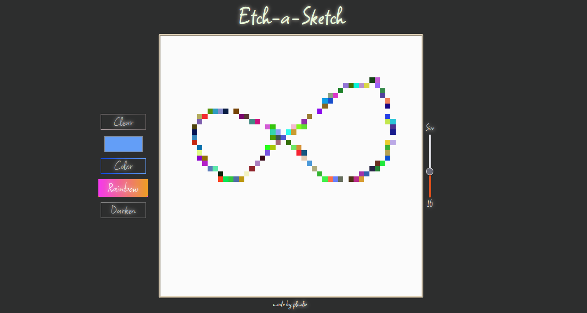

# Etch-a-Sketch
The Odin Project Curriculum project

I learned a lot with this project, mainly about DOM manipulation and event listeners.
Despite the simple looking Etch-a-sketch design i passed long time in this project to make everything work as desired.

[Etch a sketch](https://plmdie.github.io/Etch-a-Sketch/)
